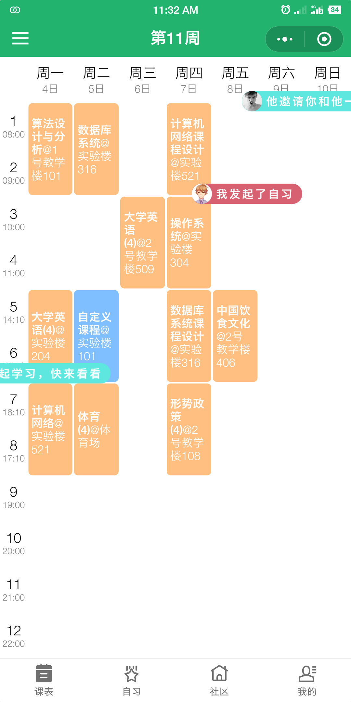
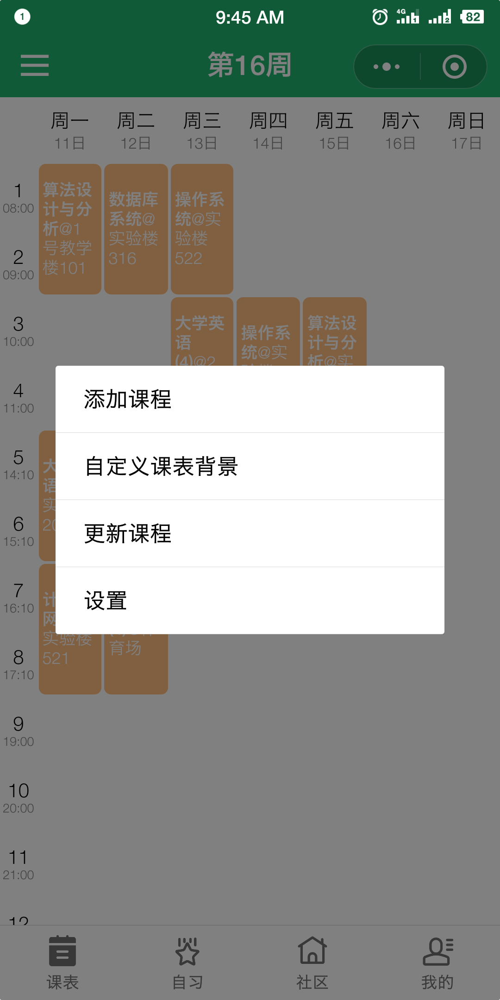
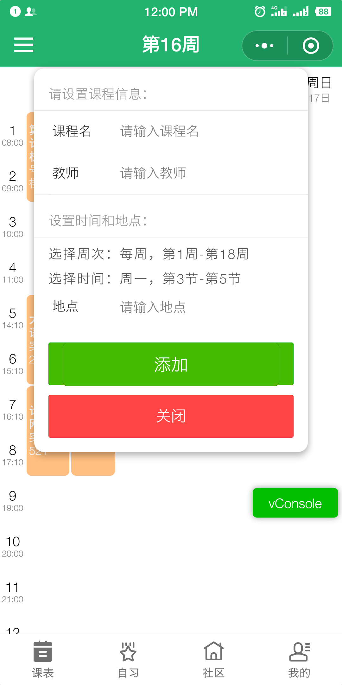
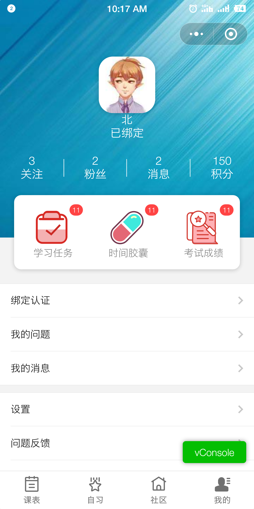
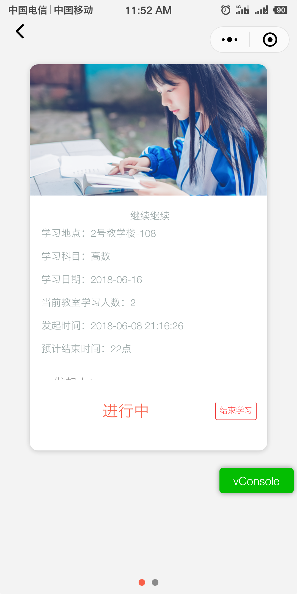
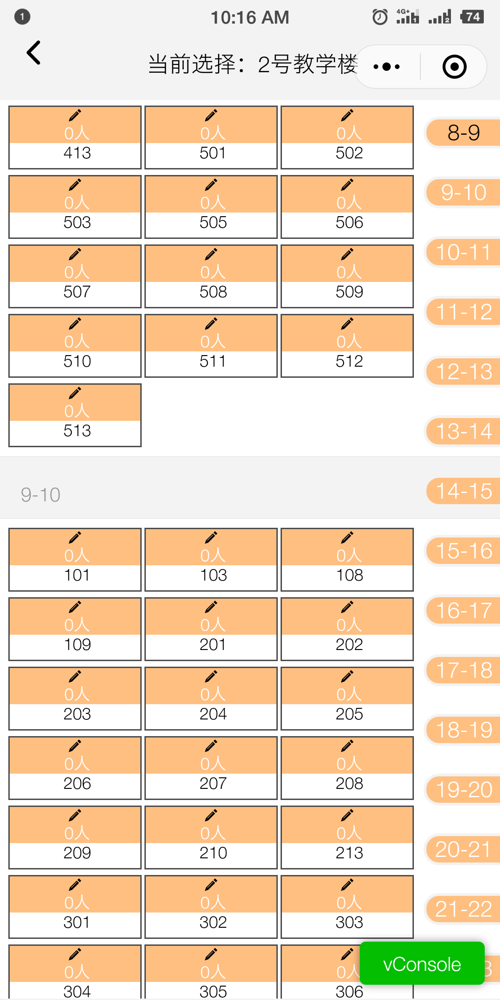
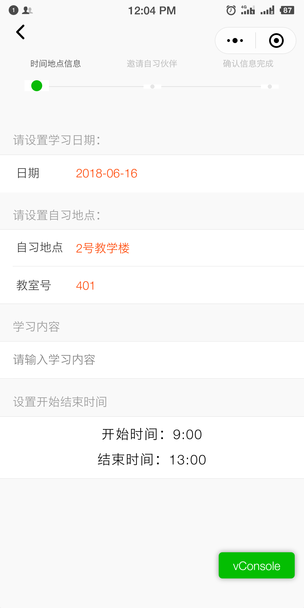
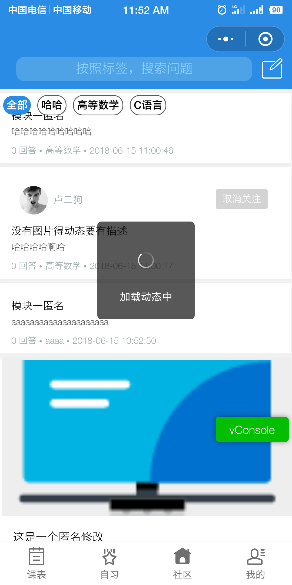
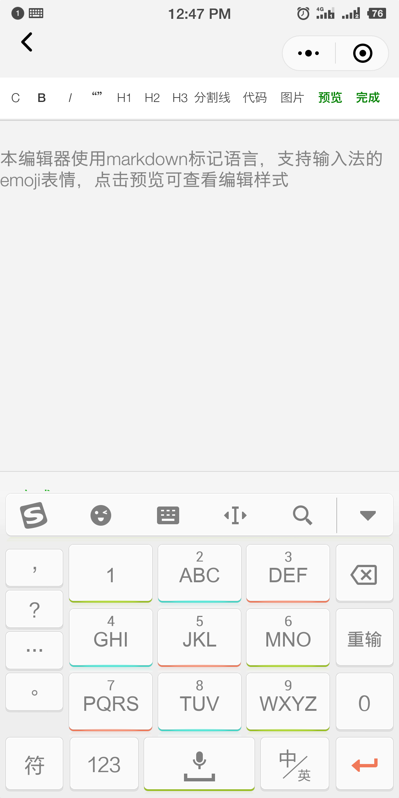
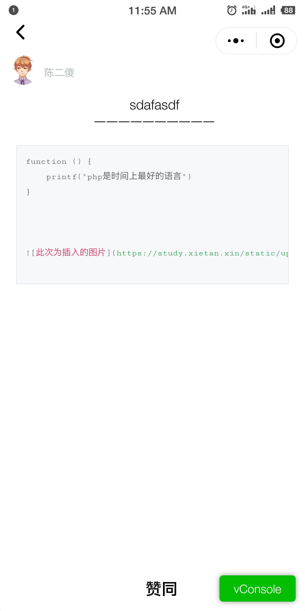

# 自习联盟微信小程序

> 2018 年微信小程序大赛参赛作品（未完成品），目前没有后续开发计划，作为记录，可供学习和参考

## 项目介绍

本项目是以微信小程序为载体，针对校内大学生在自主学习、教务信息查询、校内社交等方面的需求，而建立的校园学习管理软件。该 APP 主要面向高校师生，以提升学生自主学习的质量和效率为核心，帮助学生合理利用课余时间制定学习计划，发展校内社交媒体，帮助用户寻找志趣相投的学习伙伴，建立学生用户校内学习朋友圈，从而提升学生学习动力。

> 对应 thinkphp api [https://github.com/fanioc/study-api](https://github.com/fanioc/study-api)

## 项目截图

### 弹幕组件&&课表页面


添加自定义课表



### 个人中心页面



### 自习页面







### 社区页面



### markdown 编辑器 (toml)

markdown 编辑器

markdown 渲染


## 项目架构

### 目录结构

```
├─components            自定义组件目录
├─debug                 调试页面目录
├─extends               引用扩展库目录
├─image                 图片资源文件
├─pages                 页面文件
│  ├─community          社区问答页面
│  ├─markdown_editor    markdown文档编辑器
│  ├─me                 我的中心页面
│  ├─personal_info      个人信息页面
│  ├─schedule           课表页面
│  ├─welcome            欢迎界面
│  └─study              自习页面
├─template              模板页面
└─util                  引用js工具文件
```

### 页面逻辑

#### 欢迎界面(`pages/welcome`)：

当用户第一次使用小程序时显示，初始化用户设置

1. 确认基本设置

   - 设置用户的基本设置
   - 默认接受用户的邀请
   - 是否向他人展示个人信息

2. 确认协议
   - 绑定微信授权按钮，判断用户是否愿意读取信息
   - 如果拒绝，更新`userBasicInfo`并设置个人信息 nickName 为未授权，头像为灰
   - 如果同意：调用`wx.getUserInof`更新`userBasicInfo`

#### 课表页面(`pages/schedule`)：

1. 用户可以通过绑定认证，从教务系统导入课表
2. 可以自定义添加课表
3. 自定义课表背景
4. 课表缓存机制，方便无网使用

#### 自习页面(`pages/study`)：

1. 从地图上选择自习地点，可以在地图上清楚的看到每个地方有多少在自习
2. 提供特定地点的空场地情况，方便学生选择地点自习
3. 显示学生的自习列表，展示正在进行，已完成，待处理的学习任务。
4. 展示他人公开的学习小组，可以加入该小组，并进行共同学习

#### 问答页面(`pages/question`)：

1. 问题标签分类，同时可以搜索问题
2. 用户可以提出问题和回答他人问题
3. 回答问题采用 markdown 编辑器，丰富回答内容
4. 回答草稿保存在缓存中，下次打开可以继续编辑

#### 我的页面(`pages/me`)：

```
1.展示个人信息
2.设置部分
  弹幕不显示类型
  弹幕模式，海量-简单

    教务认证绑定
    更新教务信息

    主题选择

    自定义课表设置
    清除自定义课表背景

清除缓存，重新启动

    微信个人信息授权
        是否允许读取个人信息
        是否允许读取定位...
```

#### 个人信息页面(`pages/personal`):

1. 展示他人信息
2. 对他人进行邀请，留言等功能呢
3. 显示他人公开的自习情况，可以加入或发消息

### 核心文件 `util/core.js`

每个页面引入全局核心文件 `core.js`，负责全局 js 前后端交互逻辑的处理。

1. Core 中引入扩展文件，作为统一的入口文件
2. 管理全局第三方 session 的更新与获取，避免造成不同步
3. 读写全局用户信息和设置
4. 后台 api 访问统一调用函数，并附有错误重试机制
5. 统一错误的提示与反馈机制
6. 全局读写信息同步，可避免造成多次修改信息导致不同步的情况。
7. 全局的上传文件函数

## 参与贡献

- 卢林杨
- 陈靖
